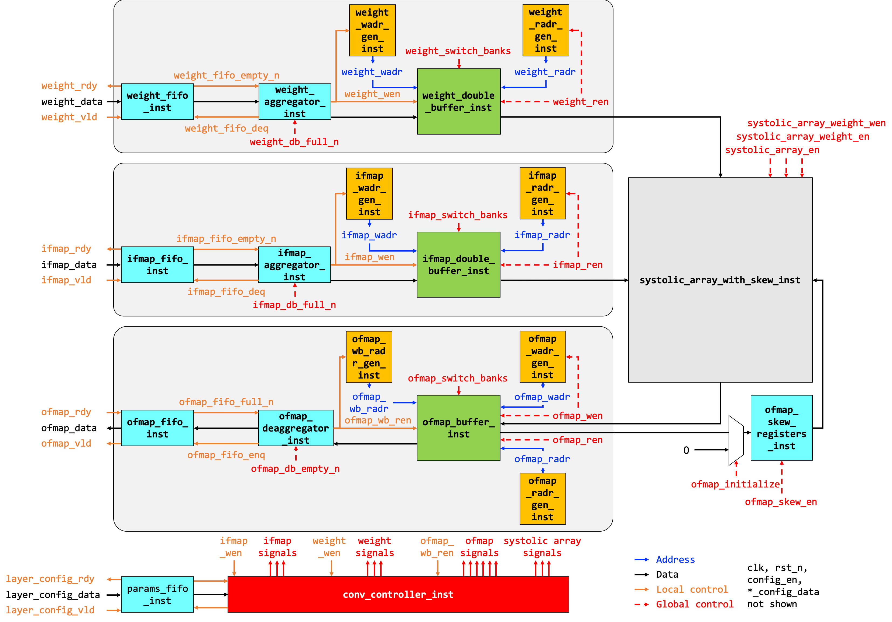

# Verilog Implementation of DNN Accelerator

* Verilog source files are in `verilog` directory.
* Unit tests for all modules are in `tests` directory.
* `autograder.py` has the commands to run each test. 
* Before running tests you need to be in bash and load the following modules:
```
bash
module load base
module load vcs
```
* Then you can run any unit test by either running the autograder or by copying over the corresponding command and running it on command line. For example, this command compiles the Verilog source and the test bench for MAC unit.
```
vcs -full64 -sverilog -timescale=1ns/1ps -debug_access+pp tests/mac_tb.v verilog/mac.v
```
* Then the following command runs the test:
```
./simv
```
* If the test does not pass, you can debug looking at the assertion that failed. You can insert more assertions and print statements in your code. You can also open the `dump.vcd` file in a waveform viewer to look at all the signals:
```
dve -full64 -vpd dump.vcd &
```
You can browse the signals hierarchically in the 'Hierarchy' pane on the left. Then select a signal from the middle pane, right click and 'Add To Waves' > 'New Wave View'. This will open the signal in a waveform viewer. For adding more signals to the same waveform, follow the same steps but in the end add to the same previously created waveform ('Add To Wave.1' if your previous waveform window is called Wave.1 in its title bar).

* You should first individually develop each module, and make sure its unit test passes. Before submitting, run all tests with autograder and make sure there are no errors.

# Documentation for Tools
The documentation for the tools is at the following locations on the caddy server:
* VCS: `/cad/synopsys/doc/vcs.pdf`
* SystemVerilog: `/cad/synopsys/doc/SystemVerilog_3.1a.pdf`

# DNN Accelerator Block Diagram


